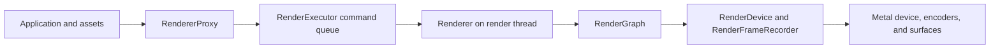
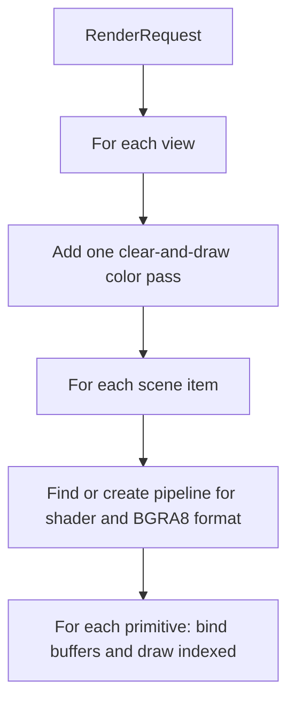

# Renderer design

This document describes the renderer as it is implemented now. The sandbox in
[`src/sandbox/main.cpp`](../src/sandbox/main.cpp) shows the complete path from a
window, shader, and primitive to a submitted frame.

## How a frame moves through the system

`RenderingSystem` creates the `RenderDevice`, `Renderer`, and `RenderExecutor`.
The proxy puts commands on the executor's thread-safe queue. The executor
dispatches commands and calls `Renderer::tick()` on its own thread. This keeps
GPU resource creation and frame recording on the render thread.

The application submits a `RenderRequest` containing a `RenderScene`, one or
more `RenderView`s, and a clear color. Each scene item has a shader handle and a
list of uploaded primitives. Each view names a render target. The request is
copied into the renderer's pending queue; successful `RendererProxy::submit()`
means the renderer accepted the request, not that the GPU finished it.

## Resources used by a scene

- **Shader:** `ShaderLoader` reads compiled shader bytes and adjacent JSON
  metadata with entry point names and stages. Shader assets ask the proxy to
  create a device shader. The Metal implementation loads the bytes as a Metal
  library and looks up those entry points.
- **Primitive:** `PrimitiveUploadData` contains `Vertex3` positions and `u32`
  indices. Upload creates one Metal buffer for each, copies the bytes into
  shared storage, and returns their handles, offsets, and index count. The
  caller can later free both buffers through the proxy.
- **Target:** The application creates a target from a surface provider, such as
  `SDLMetalWindow`. The Metal device attaches its `CAMetalLayer` and sets its
  pixel format to `BGRA8Unorm`.
- **Pipeline:** The renderer caches a graphics pipeline by shader handle and
  color format. On the first use of a pair, it asks the device to create the
  pipeline; later draws reuse its handle. The current renderer always requests
  `bgra8unorm`. Metal requires vertex and fragment shader functions and sets a
  fixed vertex layout: a `float3` position from `Vertex3` in vertex buffer slot
  zero. The renderer has no pipeline eviction or shader-change invalidation.

`RenderTarget` can hold either a surface or texture handle, but this path
currently creates and renders to surfaces only. The Metal recorder returns an
error for a texture target. There is no texture creation or sampled texture
binding in the current `RenderDevice` interface.

## Recording a request

For each view, `Renderer::recordFrame()` adds one color pass named `Main Pass`.
Its attachment uses the request's clear color, `LoadOp::clear`, and
`StoreOp::store`. Every pass draws all scene items; a view does not filter the
scene. For each item, the pass resolves its pipeline, binds it, then binds each
primitive's vertex and index buffers and calls `drawIndexed()` with its index
count. Metal currently draws triangles with 32-bit indices.

`RenderGraph` is currently a frame-local list of passes. It copies each pass's
label and color attachments, then calls `RenderFrameRecorder::renderPass()` in
insertion order. It does not inspect resource reads or writes, reorder passes,
or insert synchronization. Its role today is to group and record the passes
created for a request.

The RHI boundary uses handles and small descriptions rather than exposing
Metal objects to `Renderer`. `RenderDevice` owns resource creation, frame
submission, and GPU idle waiting. `RenderFrameRecorder` starts a render pass;
its `RenderPassEncoder` binds a pipeline and buffers and records draws. Only
graphics render passes are implemented.

## Submitting and presenting

`Renderer::submit()` queues at most `maxFramesInFlight` pending requests
(default: 3). `tick()` tries the oldest request. The Metal device has the same
number of frame slots, each guarded by a latch released when its command buffer
completes. If the next slot is busy, the device returns
`tooManyFramesInFlight`; the renderer keeps the request and retries it on a
later tick. On successful submission, it removes the request and advances its
frame number. Other recording or submission errors are logged and the request
is dropped.

For a surface pass, the Metal recorder gets a drawable from the surface layer
when it needs the attachment. It reuses that drawable if another pass in the
same frame uses the same surface. It creates a Metal render encoder, translates
the pass's load and store operations, records the callback, and ends the
encoder. After all passes are recorded, it schedules presentation of acquired
drawables and commits the command buffer. Submission returns after commit;
GPU completion happens later.

If a surface has no drawable, the recorder returns
`renderSurfaceNotDrawable`. `RenderGraph` skips that pass and continues with
other passes. Other pass errors stop frame recording. On shutdown,
`RenderingSystem` stops the executor and waits for the device's frame slots to
finish.

## Current boundaries

The implemented backend is Metal. `Platform::createRenderDevice()` selects it
for Metal builds; the Vulkan branch has no device implementation. The renderer
has no compute or copy passes, render graph dependency tracking, texture
outputs, material bindings, depth attachments, or dynamic vertex layouts. The
current `Vertex3` contains only a position, and the Metal pipeline uses that
layout directly rather than matching shader input reflection.
